<p align="center">
  
</p>

<p align="center">
  <a href="https://www.python.org/downloads/"></a>
  <a href="https://opensource.org/licenses/MIT"></a>
  <a href="https://github.com/PNNL-CMM/cmm-data/actions"></a>
  <a href="https://github.com/PNNL-CMM/cmm-data"></a>
</p>

<p align="center">
  <b>A comprehensive Python package providing unified access to datasets for critical minerals supply chain modeling.</b><br>
  Developed by Nancy Washton.
</p>

<p align="center">
  <a href="#installation">Installation</a> •
  <a href="#quick-start">Quick Start</a> •
  <a href="#available-datasets">Datasets</a> •
  <a href="#visualizations">Visualizations</a> •
  <a href="#api-reference">API Reference</a> •
  <a href="QUICKSTART_COLLABORATORS.md">Collaborator Guide</a>
</p>

---

## Table of Contents

- [Demo](#demo)
- [Overview](#overview)
- [Features](#features)
- [Installation](#installation)
- [Quick Start](#quick-start)
- [Available Datasets](#available-datasets)
- [Detailed Usage](#detailed-usage)
  - [USGS Commodity Data](#usgs-commodity-data)
  - [USGS Ore Deposits](#usgs-ore-deposits)
  - [Document Corpus](#document-corpus)
  - [OECD Supply Chain](#oecd-supply-chain)
  - [Geoscience Australia 3D Model](#geoscience-australia-3d-model)
  - [NETL REE/Coal Database](#netl-reecoal-database)
- [Visualizations](#visualizations)
- [Configuration](#configuration)
- [API Reference](#api-reference)
- [Data Sources](#data-sources)
- [Critical Minerals List](#critical-minerals-list)
- [Examples](#examples)
- [Troubleshooting](#troubleshooting)
- [Contributing](#contributing)
- [License](#license)
- [Citation](#citation)
- [Contact](#contact)

---

## Demo

<p align="center">
  
</p>

---

## Overview

The `cmm_data` package addresses a common challenge in critical minerals research: accessing and integrating data from multiple heterogeneous sources. Researchers working on supply chain modeling, resource assessment, and policy analysis often need to combine data from:

- **USGS** - Mineral commodity statistics and geochemical databases
- **OECD/IEA** - Trade data and critical minerals outlooks
- **DOE National Labs** - Technical reports and specialized databases
- **International geological surveys** - Geospatial and subsurface models

This package provides a unified Python API to access all these data sources with:

- Consistent data structures (pandas DataFrames)
- Automatic handling of data quality issues (missing values, special codes)
- Built-in caching for performance
- Visualization utilities for quick exploration

---

## Features

### Core Capabilities

| Feature | Description |
|---------|-------------|
| **Unified API** | Single interface for 8 different data sources |
| **80+ Commodities** | Complete USGS Mineral Commodity Summaries coverage |
| **Data Parsing** | Automatic handling of W (withheld), NA, ranges, and special codes |
| **Caching** | Built-in memory and disk caching for performance |
| **Type Safety** | Full type hints for IDE support |
| **Extensible** | Easy to add new data loaders |

### Data Loaders

| Loader | Data Source | Records | Format |
|--------|-------------|---------|--------|
| `USGSCommodityLoader` | USGS MCS 2023 | 80+ commodities | CSV |
| `USGSOreDepositsLoader` | USGS NGDB | 356 fields | CSV |
| `OSTIDocumentsLoader` | DOE OSTI | Variable | JSON |
| `PreprocessedCorpusLoader` | CMM Corpus | 3,298 documents | JSONL |
| `GAChronostratigraphicLoader` | Geoscience Australia | 9 surfaces | GeoTIFF/XYZ |
| `NETLREECoalLoader` | NETL | Variable | Geodatabase |
| `OECDSupplyChainLoader` | OECD/IEA | Multiple | PDF/CSV |
| `GoogleScholarLoader` | Google Scholar (SerpAPI) | Query-based | API |

### Visualization Functions

- `plot_world_production()` - Bar charts of top producers
- `plot_production_timeseries()` - Time series of production/trade
- `plot_import_reliance()` - U.S. net import reliance charts
- `plot_deposit_locations()` - Geospatial deposit maps
- `plot_ree_distribution()` - REE concentration patterns

---

## Installation

### Prerequisites

- Python 3.9 or higher
- pip package manager
- Access to the Globus_Sharing data directory

### Basic Installation

```bash
# Navigate to the data directory
cd /path/to/Globus_Sharing

# Install the package in development mode
pip install -e cmm_data
```

### Installation with Optional Dependencies

```bash
# Visualization support (matplotlib, plotly)
pip install -e "cmm_data[viz]"

# Geospatial support (geopandas, rasterio, fiona)
pip install -e "cmm_data[geo]"

# Full installation (all optional dependencies)
pip install -e "cmm_data[full]"
```

### Recommended: Using Virtual Environment

```bash
# Navigate to the data directory
cd /path/to/Globus_Sharing

# Create a virtual environment
python3 -m venv .venv

# Activate the environment
source .venv/bin/activate  # Linux/macOS
# or
.venv\Scripts\activate     # Windows

# Install with all dependencies
pip install -e "cmm_data[full]"
```

### Verify Installation

```bash
# Run the verification script
python cmm_data/scripts/verify_installation.py

# Or run the test suite
python cmm_data/scripts/run_all_tests.py
```

### Installing from Wheel

If you received a wheel file:

```bash
pip install cmm_data-0.1.0-py3-none-any.whl
```

---

## Quick Start

### Basic Usage

```python
import cmm_data

# Check version
print(f"CMM Data version: {cmm_data.__version__}")

# View all available datasets
catalog = cmm_data.get_data_catalog()
print(catalog)

# List all commodity codes
commodities = cmm_data.list_commodities()
print(f"Available commodities: {len(commodities)}")

# List DOE critical minerals
critical = cmm_data.list_critical_minerals()
print(f"Critical minerals: {critical}")
```

### Load Data

```python
import cmm_data

# Load lithium world production data
lithium = cmm_data.load_usgs_commodity("lithi", "world")
print(lithium)

# Load cobalt U.S. statistics
cobalt = cmm_data.load_usgs_commodity("cobal", "salient")
print(cobalt)
```

### Quick Visualization

```python
import cmm_data
from cmm_data.visualizations.commodity import plot_world_production

# Load and plot
df = cmm_data.load_usgs_commodity("lithi", "world")
fig = plot_world_production(df, "Lithium", top_n=10)
fig.savefig("lithium_production.png")
```

---

## Available Datasets

### 1. USGS Mineral Commodity Summaries (MCS 2023)

**Location:** `USGS_Data/`

The USGS Mineral Commodity Summaries provide annual data on production, trade, and reserves for over 80 mineral commodities worldwide.

**Data Types:**
- **World Production** (`world/`): Production by country, reserves, and notes
- **Salient Statistics** (`salient/`): U.S. production, imports, exports, consumption, prices

**Coverage:**
- Years: 2018-2022 (varies by commodity)
- Countries: 50+ producing nations
- Commodities: 80+ minerals and materials

**Key Fields (World Production):**
| Field | Description |
|-------|-------------|
| `Country` | Producing country name |
| `Prod_t_2021` | Production in metric tons (2021) |
| `Prod_t_est_2022` | Estimated production (2022) |
| `Reserves_t` | Reserves in metric tons |
| `Prod_notes` | Production footnotes |
| `Reserves_notes` | Reserves footnotes |

**Key Fields (Salient Statistics):**
| Field | Description |
|-------|-------------|
| `Year` | Data year |
| `USprod_t` | U.S. production (metric tons) |
| `Imports_t` | U.S. imports (metric tons) |
| `Exports_t` | U.S. exports (metric tons) |
| `Consump_t` | Apparent consumption |
| `Price_dt` | Unit value ($/metric ton) |
| `NIR_pct` | Net import reliance (%) |

---

### 2. USGS Ore Deposits Database

**Location:** `USGS_Ore_Deposits/`

Geochemical analyses from ore deposits worldwide, compiled from the National Geochemical Database (NGDB).

**Tables:**
| Table | Description |
|-------|-------------|
| `Geology` | Deposit locations and geological context |
| `BV_Ag_Mo` | Best values for Ag through Mo elements |
| `BV_Na_Zr` | Best values for Na through Zr elements |
| `ChemData1`, `ChemData2` | Raw chemical data |
| `DataDictionary` | Field definitions (356 fields) |
| `AnalyticMethod` | Analytical method descriptions |
| `Reference` | Data sources and citations |

**Coverage:**
- Elements: 60+ major and trace elements
- Samples: Thousands of ore deposit analyses
- Deposit types: Porphyry, VMS, sediment-hosted, etc.

---

### 3. Preprocessed Document Corpus

**Location:** `Data/preprocessed/`

Unified corpus of critical minerals documents prepared for LLM training and text analysis.

**File:** `unified_corpus.jsonl`

**Format:** JSON Lines (one document per line)

**Fields:**
| Field | Description |
|-------|-------------|
| `id` | Unique document identifier |
| `title` | Document title |
| `text` | Full text content |
| `source` | Origin (OSTI, USGS, etc.) |
| `doc_type` | Document type |
| `date` | Publication date |

**Statistics:**
- Documents: 3,298
- Sources: Multiple (OSTI, USGS, IEA, etc.)
- Topics: Critical minerals, extraction, processing, supply chains

---

### 4. OECD Supply Chain Data

**Location:** `OECD_Supply_Chain_Data/`

Trade data and policy information from OECD and IEA.

**Subdirectories:**
| Directory | Contents |
|-----------|----------|
| `Export_Restrictions/` | OECD inventory of export restrictions (PDFs) |
| `IEA_Critical_Minerals/` | IEA Critical Minerals Outlook reports |
| `ICIO/` | Inter-Country Input-Output documentation |
| `BTIGE/` | Bilateral Trade documentation |

**Export Restrictions Coverage:**
- Commodities: 65 industrial raw materials
- Countries: 82 producing nations
- Years: 2009-2023
- Key minerals: Potash, molybdenum, tungsten, rare earths, lithium, cobalt

**IEA Critical Minerals:**
- Minerals: 35 critical minerals
- Scenarios: STEPS, APS, NZE (Net Zero by 2050)
- Projections: Supply, demand, prices to 2050

---

### 5. Geoscience Australia 3D Chronostratigraphic Model

**Location:** `GA_149923_Chronostratigraphic/`

Preliminary 3D chronostratigraphic model of Australia providing depth surfaces for major geological time boundaries.

**Surfaces:**
1. Paleozoic_Top
2. Neoproterozoic_Top
3. Mesoproterozoic_Top
4. Paleoproterozoic_Top
5. Neoarchean_Top
6. Mesoarchean_Top
7. Paleoarchean_Top
8. Eoarchean_Top
9. Basement

**Formats:**
| Format | Description | Size |
|--------|-------------|------|
| GeoTIFF | Raster grids for GIS | ~1.2 GB |
| XYZ | ASCII point data | ~5.9 GB |
| ZMAP | Grid format for modeling | ~1.2 GB |
| PNG | Visualization images | ~51 MB |

**Spatial Reference:** EPSG:3577 (GDA94 / Australian Albers)

---

### 6. NETL REE and Coal Database

**Location:** `NETL_REE_Coal/`

Rare earth element data from coal and coal-related resources compiled by the National Energy Technology Laboratory.

**Format:** ArcGIS Geodatabase (`.gdb`)

**Contents:**
- REE concentration data from coal samples
- Coal basin boundaries
- Sample locations with coordinates
- Analytical results for La, Ce, Pr, Nd, Sm, Eu, Gd, Tb, Dy, Ho, Er, Tm, Yb, Lu, Y

**Requirements:** geopandas, fiona (install with `pip install cmm-data[geo]`)

---

## Detailed Usage

### USGS Commodity Data

#### Using the Loader Class

```python
from cmm_data import USGSCommodityLoader

# Initialize loader
loader = USGSCommodityLoader()

# List all available commodities
commodities = loader.list_available()
print(f"Available: {len(commodities)} commodities")
print(commodities[:10])  # First 10

# Get commodity name from code
print(loader.get_commodity_name("lithi"))  # "Lithium"
print(loader.get_commodity_name("raree"))  # "Rare Earths"

# List critical minerals only
critical = loader.list_critical_minerals()
print(f"Critical minerals: {critical}")
```

#### Loading World Production Data

```python
from cmm_data import USGSCommodityLoader

loader = USGSCommodityLoader()

# Load lithium world production
lithium = loader.load_world_production("lithi")
print(lithium.columns)
# ['Source', 'Country', 'Type', 'Prod_t_2021', 'Prod_t_est_2022',
#  'Prod_notes', 'Reserves_t', 'Reserves_notes', 'Prod_t_2021_clean',
#  'Prod_t_est_2022_clean', 'Reserves_t_clean', 'commodity_code',
#  'commodity_name']

# View the data
print(lithium[['Country', 'Prod_t_est_2022', 'Reserves_t']])
```

#### Loading Salient Statistics

```python
from cmm_data import USGSCommodityLoader

loader = USGSCommodityLoader()

# Load cobalt salient statistics (U.S. time series)
cobalt = loader.load_salient_statistics("cobal")
print(cobalt.columns)
# ['DataSource', 'Commodity', 'Year', 'USprod_t', 'Imports_t',
#  'Exports_t', 'Consump_t', 'Price_dt', 'Employment_num', 'NIR_pct',
#  'USprod_t_clean', 'Imports_t_clean', ...]

# View time series
print(cobalt[['Year', 'Imports_t', 'Exports_t', 'NIR_pct']])
```

#### Getting Top Producers

```python
from cmm_data import USGSCommodityLoader

loader = USGSCommodityLoader()

# Get top 10 rare earth producers
top_ree = loader.get_top_producers("raree", top_n=10)
print(top_ree[['Country', 'Prod_t_est_2022', 'Reserves_t']])

# Get top lithium producers
top_lithium = loader.get_top_producers("lithi", top_n=5)
for _, row in top_lithium.iterrows():
    print(f"{row['Country']}: {row['Prod_t_est_2022']:,} t")
```

#### Using Convenience Functions

```python
import cmm_data

# Quick loading without creating loader instance
df_world = cmm_data.load_usgs_commodity("lithi", "world")
df_salient = cmm_data.load_usgs_commodity("lithi", "salient")

# These are equivalent to:
# loader = cmm_data.USGSCommodityLoader()
# df_world = loader.load_world_production("lithi")
# df_salient = loader.load_salient_statistics("lithi")
```

#### Working with Multiple Commodities

```python
from cmm_data import USGSCommodityLoader
import pandas as pd

loader = USGSCommodityLoader()

# Compare critical minerals
minerals = ['lithi', 'cobal', 'nicke', 'graph', 'raree']

comparison = []
for code in minerals:
    df = loader.load_salient_statistics(code)
    latest = df.iloc[-1]
    comparison.append({
        'Commodity': loader.get_commodity_name(code),
        'Year': latest['Year'],
        'Imports_t': latest.get('Imports_t_clean', latest.get('Imports_t')),
        'NIR_pct': latest['NIR_pct']
    })

result = pd.DataFrame(comparison)
print(result)
```

---

### USGS Ore Deposits

#### Loading Tables

```python
from cmm_data import USGSOreDepositsLoader

loader = USGSOreDepositsLoader()

# List available tables
tables = loader.list_available()
print(f"Available tables: {tables}")

# Load data dictionary
data_dict = loader.load_data_dictionary()
print(f"Total fields: {len(data_dict)}")
print(data_dict[['FIELD_NAME', 'FIELD_DESC', 'FIELD_UNIT']].head(20))

# Load geology data
geology = loader.load_geology()
print(f"Deposits: {len(geology)}")
```

#### Working with Geochemistry Data

```python
from cmm_data import USGSOreDepositsLoader

loader = USGSOreDepositsLoader()

# Load combined geochemistry (all elements)
geochem = loader.load_geochemistry()
print(f"Columns: {len(geochem.columns)}")

# Load specific elements only
ree_data = loader.load_geochemistry(elements=['La', 'Ce', 'Nd', 'Y'])
print(ree_data.head())

# Get REE samples directly
ree_samples = loader.get_ree_samples()
print(f"REE samples: {len(ree_samples)}")
```

#### Element Statistics

```python
from cmm_data import USGSOreDepositsLoader

loader = USGSOreDepositsLoader()

# Get statistics for lanthanum
la_stats = loader.get_element_statistics("La")
print(f"Lanthanum (La):")
print(f"  Total samples: {la_stats['total_samples']}")
print(f"  Valid samples: {la_stats['valid_samples']}")
print(f"  Mean: {la_stats['mean']:.2f} ppm")
print(f"  Max: {la_stats['max']:.2f} ppm")

# Compare multiple REE elements
for elem in ['La', 'Ce', 'Nd', 'Y']:
    stats = loader.get_element_statistics(elem)
    print(f"{elem}: mean={stats['mean']:.1f}, max={stats['max']:.1f} ppm")
```

#### Searching Deposits

```python
from cmm_data import USGSOreDepositsLoader

loader = USGSOreDepositsLoader()

# Search by deposit type
porphyry = loader.search_deposits(deposit_type="porphyry")
print(f"Porphyry deposits: {len(porphyry)}")

# Search by commodity
copper = loader.search_deposits(commodity="copper")
print(f"Copper deposits: {len(copper)}")

# Search by country
australia = loader.search_deposits(country="Australia")
print(f"Australian deposits: {len(australia)}")
```

---

### Document Corpus

#### Loading the Corpus

```python
from cmm_data import PreprocessedCorpusLoader

loader = PreprocessedCorpusLoader()

# Get corpus statistics
stats = loader.get_corpus_stats()
print(f"Total documents: {stats['total_documents']}")
print(f"Columns: {stats['columns']}")

if 'text_stats' in stats:
    print(f"Total characters: {stats['text_stats']['total_chars']:,}")
    print(f"Mean doc length: {stats['text_stats']['mean_length']:,.0f}")

if 'source_distribution' in stats:
    print(f"Sources: {stats['source_distribution']}")
```

#### Searching Documents

```python
from cmm_data import PreprocessedCorpusLoader

loader = PreprocessedCorpusLoader()

# Search for documents about lithium
results = loader.search("lithium extraction", limit=10)
print(f"Found {len(results)} documents")

for _, doc in results.iterrows():
    title = doc.get('title', 'No title')[:60]
    print(f"  - {title}")

# Search with specific fields
results = loader.search("rare earth", fields=['title', 'abstract'], limit=5)
```

#### Iterating Over Documents

```python
from cmm_data import PreprocessedCorpusLoader

loader = PreprocessedCorpusLoader()

# Iterate one document at a time
for i, doc in enumerate(loader.iter_documents()):
    if i >= 5:
        break
    print(f"Document {i}: {doc.get('title', 'No title')[:50]}")

# Iterate in batches
for batch in loader.iter_documents(batch_size=100):
    print(f"Processing batch of {len(batch)} documents")
    # Process batch...
    break  # Just show first batch
```

#### Filtering by Source

```python
from cmm_data import PreprocessedCorpusLoader

loader = PreprocessedCorpusLoader()

# Get documents from specific source
osti_docs = loader.filter_by_source("OSTI")
print(f"OSTI documents: {len(osti_docs)}")

usgs_docs = loader.filter_by_source("USGS")
print(f"USGS documents: {len(usgs_docs)}")
```

---

### OECD Supply Chain

#### Available Data

```python
from cmm_data import OECDSupplyChainLoader

loader = OECDSupplyChainLoader()

# List available datasets
available = loader.list_available()
print(f"Available: {available}")

# Get minerals coverage information
coverage = loader.get_minerals_coverage()
for name, info in coverage.items():
    print(f"\n{name}:")
    print(f"  Description: {info['description']}")
    if 'key_minerals' in info:
        print(f"  Key minerals: {', '.join(info['key_minerals'][:5])}...")
```

#### Accessing PDF Reports

```python
from cmm_data import OECDSupplyChainLoader

loader = OECDSupplyChainLoader()

# Get export restrictions reports
export_pdfs = loader.get_export_restrictions_reports()
print("Export Restrictions Reports:")
for pdf in export_pdfs:
    print(f"  - {pdf.name} ({pdf.stat().st_size / 1e6:.1f} MB)")

# Get IEA critical minerals reports
iea_pdfs = loader.get_iea_minerals_reports()
print("\nIEA Critical Minerals Reports:")
for pdf in iea_pdfs:
    print(f"  - {pdf.name}")

# Get ICIO documentation
icio_docs = loader.get_icio_documentation()
print("\nICIO Documentation:")
for doc in icio_docs:
    print(f"  - {doc.name}")
```

#### Manual Download URLs

```python
from cmm_data import OECDSupplyChainLoader

loader = OECDSupplyChainLoader()

# Get URLs for manual download (due to Cloudflare protection)
urls = loader.get_download_urls()
print("Manual Download URLs:")
for name, url in urls.items():
    print(f"  {name}:")
    print(f"    {url}")
```

---

### Geoscience Australia 3D Model

#### Model Information

```python
from cmm_data import GAChronostratigraphicLoader

loader = GAChronostratigraphicLoader()

# Get model info
info = loader.get_model_info()
for key, value in info.items():
    print(f"{key}: {value}")

# List available surfaces
surfaces = loader.list_surfaces()
print(f"\nSurfaces: {surfaces}")

# List available formats
formats = loader.list_available()
print(f"Formats: {formats}")
```

#### Loading Surface Data

```python
from cmm_data import GAChronostratigraphicLoader

loader = GAChronostratigraphicLoader()

# Load surface as XYZ points
try:
    paleozoic = loader.load("Paleozoic_Top", format="xyz")
    print(f"Points: {len(paleozoic)}")
    print(paleozoic.describe())
except Exception as e:
    print(f"Data not available: {e}")

# Get surface extent
try:
    extent = loader.get_surface_extent("Basement")
    print(f"Basement extent:")
    print(f"  X: {extent['xmin']:.0f} to {extent['xmax']:.0f}")
    print(f"  Y: {extent['ymin']:.0f} to {extent['ymax']:.0f}")
    print(f"  Z: {extent['zmin']:.0f} to {extent['zmax']:.0f} m")
except Exception as e:
    print(f"Error: {e}")
```

---

### NETL REE/Coal Database

#### Loading Data

```python
from cmm_data import NETLREECoalLoader

loader = NETLREECoalLoader()

# List available layers
try:
    layers = loader.list_available()
    print(f"Available layers: {layers}")
except Exception as e:
    print(f"Error: {e}")

# Load REE samples
try:
    samples = loader.get_ree_samples()
    print(f"REE samples: {len(samples)}")
    print(samples.head())
except Exception as e:
    print(f"Requires geopandas: {e}")
```

#### REE Statistics

```python
from cmm_data import NETLREECoalLoader

loader = NETLREECoalLoader()

try:
    stats = loader.get_ree_statistics()
    print("REE Statistics from Coal:")
    for elem, data in stats.items():
        print(f"  {elem}: mean={data['mean']:.1f}, max={data['max']:.1f} ppm")
except Exception as e:
    print(f"Error: {e}")
```

---

## Visualizations

### Installation

```bash
pip install cmm-data[viz]
# or
pip install matplotlib plotly
```

### World Production Chart

```python
import cmm_data
from cmm_data.visualizations.commodity import plot_world_production
import matplotlib.pyplot as plt

# Load data
df = cmm_data.load_usgs_commodity("lithi", "world")

# Create chart
fig = plot_world_production(
    df,
    commodity_name="Lithium",
    top_n=10,
    figsize=(12, 6)
)

plt.savefig("lithium_producers.png", dpi=150, bbox_inches='tight')
plt.show()
```

### Time Series Chart

```python
import cmm_data
from cmm_data.visualizations.commodity import plot_production_timeseries
import matplotlib.pyplot as plt

# Load salient statistics
df = cmm_data.load_usgs_commodity("cobal", "salient")

# Create time series chart
fig = plot_production_timeseries(
    df,
    commodity_name="Cobalt",
    figsize=(10, 6)
)

plt.savefig("cobalt_timeseries.png", dpi=150)
plt.show()
```

### Import Reliance Chart

```python
import cmm_data
from cmm_data.visualizations.commodity import plot_import_reliance
import matplotlib.pyplot as plt

# Load data
df = cmm_data.load_usgs_commodity("raree", "salient")

# Create import reliance chart
fig = plot_import_reliance(
    df,
    commodity_name="Rare Earths",
    figsize=(10, 5)
)

plt.savefig("ree_import_reliance.png", dpi=150)
plt.show()
```

### Critical Minerals Comparison

```python
from cmm_data.visualizations.timeseries import plot_critical_minerals_comparison
import matplotlib.pyplot as plt

# Compare import values across critical minerals
fig = plot_critical_minerals_comparison(
    metric="Imports_t",
    top_n=15,
    figsize=(14, 8)
)

plt.savefig("critical_minerals_comparison.png", dpi=150)
plt.show()
```

### Custom Multi-Panel Figure

```python
import cmm_data
from cmm_data.visualizations.commodity import (
    plot_world_production,
    plot_production_timeseries,
    plot_import_reliance
)
import matplotlib.pyplot as plt

# Create figure with subplots
fig, axes = plt.subplots(2, 2, figsize=(14, 10))

# Lithium producers
df_world = cmm_data.load_usgs_commodity("lithi", "world")
plot_world_production(df_world, "Lithium", top_n=6, ax=axes[0, 0])

# Lithium time series
df_salient = cmm_data.load_usgs_commodity("lithi", "salient")
plot_production_timeseries(df_salient, "Lithium", ax=axes[0, 1])

# Cobalt producers
df_world = cmm_data.load_usgs_commodity("cobal", "world")
plot_world_production(df_world, "Cobalt", top_n=6, ax=axes[1, 0])

# Cobalt import reliance
df_salient = cmm_data.load_usgs_commodity("cobal", "salient")
plot_import_reliance(df_salient, "Cobalt", ax=axes[1, 1])

plt.tight_layout()
plt.savefig("critical_minerals_dashboard.png", dpi=150)
plt.show()
```

---

## Configuration

### Automatic Configuration

The package automatically detects the data directory by:

1. Checking `CMM_DATA_PATH` environment variable
2. Searching parent directories for `Globus_Sharing`
3. Checking common installation paths

### Manual Configuration

```python
import cmm_data

# Configure data path
cmm_data.configure(data_root="/path/to/Globus_Sharing")

# Configure caching
cmm_data.configure(
    cache_enabled=True,
    cache_ttl_seconds=7200  # 2 hours
)

# View current configuration
config = cmm_data.get_config()
print(f"Data root: {config.data_root}")
print(f"Cache enabled: {config.cache_enabled}")
print(f"Cache TTL: {config.cache_ttl_seconds} seconds")
```

### Environment Variable

```bash
# Set in shell
export CMM_DATA_PATH=/path/to/Globus_Sharing

# Or in Python
import os
os.environ['CMM_DATA_PATH'] = '/path/to/Globus_Sharing'

import cmm_data
print(cmm_data.get_config().data_root)
```

### Validating Configuration

```python
import cmm_data

config = cmm_data.get_config()

# Check what datasets are available
status = config.validate()
print("Dataset availability:")
for dataset, available in status.items():
    icon = "[OK]" if available else "[--]"
    print(f"  {icon} {dataset}")
```

---

## API Reference

### Module-Level Functions

| Function | Description |
|----------|-------------|
| `get_data_catalog()` | Returns DataFrame with all dataset metadata |
| `list_commodities()` | Returns list of all commodity codes |
| `list_critical_minerals()` | Returns list of DOE critical mineral codes |
| `load_usgs_commodity(code, type)` | Quick load of USGS data |
| `load_ore_deposits(table)` | Quick load of ore deposits data |
| `search_documents(query)` | Search OSTI documents |
| `iter_corpus_documents()` | Iterate over corpus |
| `configure(**kwargs)` | Set configuration options |
| `get_config()` | Get current configuration |

### Loader Classes

All loaders inherit from `BaseLoader` and provide:

| Method | Description |
|--------|-------------|
| `load(**kwargs)` | Load data, returns DataFrame |
| `list_available()` | List available data items |
| `describe()` | Return dataset metadata dict |
| `query(**kwargs)` | Query with filters |

### USGSCommodityLoader

| Method | Description |
|--------|-------------|
| `load_world_production(commodity)` | Load world production data |
| `load_salient_statistics(commodity)` | Load U.S. statistics |
| `get_top_producers(commodity, top_n)` | Get top producing countries |
| `get_commodity_name(code)` | Get full name from code |
| `list_critical_minerals()` | List critical mineral codes |

### USGSOreDepositsLoader

| Method | Description |
|--------|-------------|
| `load(table)` | Load specific table |
| `load_data_dictionary()` | Load field definitions |
| `load_geology()` | Load deposit information |
| `load_geochemistry(elements)` | Load geochemistry data |
| `get_ree_samples()` | Get REE analyses |
| `get_element_statistics(element)` | Get element statistics |
| `search_deposits(**filters)` | Search deposits |

### PreprocessedCorpusLoader

| Method | Description |
|--------|-------------|
| `load(corpus_file)` | Load corpus as DataFrame |
| `iter_documents(batch_size)` | Iterate over documents |
| `get_corpus_stats()` | Get corpus statistics |
| `search(query, fields, limit)` | Search documents |
| `filter_by_source(source)` | Filter by source |

### OECDSupplyChainLoader

| Method | Description |
|--------|-------------|
| `load(dataset)` | Load dataset file inventory |
| `get_pdf_paths(dataset)` | Get PDF file paths |
| `get_export_restrictions_reports()` | Get export restrictions PDFs |
| `get_iea_minerals_reports()` | Get IEA report PDFs |
| `get_minerals_coverage()` | Get coverage information |
| `get_download_urls()` | Get manual download URLs |

---

## Data Sources

| Source | Description | URL |
|--------|-------------|-----|
| USGS MCS | Mineral Commodity Summaries | https://www.usgs.gov/centers/national-minerals-information-center/mineral-commodity-summaries |
| USGS NGDB | National Geochemical Database | https://mrdata.usgs.gov/ngdb/rock/ |
| OSTI | Office of Scientific and Technical Information | https://www.osti.gov/ |
| Geoscience Australia | eCat Metadata Catalog | https://ecat.ga.gov.au/ |
| NETL | National Energy Technology Laboratory | https://www.netl.doe.gov/ |
| OECD | Data Explorer | https://data-explorer.oecd.org/ |
| IEA | Critical Minerals Data Explorer | https://www.iea.org/data-and-statistics/data-tools/critical-minerals-data-explorer |

---

## Critical Minerals List

The DOE Critical Minerals List (2023) includes 50 minerals. This package covers the following 27 with USGS data:

| Code | Mineral | Code | Mineral |
|------|---------|------|---------|
| `alumi` | Aluminum | `nicke` | Nickel |
| `antim` | Antimony | `niobi` | Niobium |
| `arsen` | Arsenic | `plati` | Platinum Group |
| `barit` | Barite | `raree` | Rare Earths |
| `beryl` | Beryllium | `tanta` | Tantalum |
| `bismu` | Bismuth | `tellu` | Tellurium |
| `chrom` | Chromium | `tin` | Tin |
| `cobal` | Cobalt | `titan` | Titanium |
| `fluor` | Fluorspar | `tungs` | Tungsten |
| `galli` | Gallium | `vanad` | Vanadium |
| `germa` | Germanium | `zinc` | Zinc |
| `graph` | Graphite | `zirco-hafni` | Zirconium/Hafnium |
| `indiu` | Indium | | |
| `lithi` | Lithium | | |
| `manga` | Manganese | | |

---

## Examples

### Example Scripts

The `examples/` directory contains:

| File | Description |
|------|-------------|
| `basic_usage.py` | Basic API usage examples |
| `visualization_examples.py` | Chart generation examples |
| `data_export.py` | Export to CSV/Excel |
| `cmm_data_tutorial.ipynb` | Comprehensive Jupyter tutorial |

### Running Examples

```bash
# Basic usage
python cmm_data/examples/basic_usage.py

# Generate visualizations
python cmm_data/examples/visualization_examples.py

# Export data
python cmm_data/examples/data_export.py

# Jupyter tutorial
jupyter notebook cmm_data/examples/cmm_data_tutorial.ipynb
```

---

## Troubleshooting

### Package Import Fails

```bash
# Check installation
pip list | grep cmm

# Reinstall
pip uninstall cmm-data
pip install -e /path/to/cmm_data
```

### Data Not Found

```python
import cmm_data

# Check configuration
config = cmm_data.get_config()
print(f"Data root: {config.data_root}")

# Validate
status = config.validate()
for ds, available in status.items():
    print(f"{ds}: {available}")

# Reconfigure if needed
cmm_data.configure(data_root="/correct/path/to/Globus_Sharing")
```

### Missing Dependencies

```bash
# For visualizations
pip install matplotlib plotly

# For geospatial data
pip install geopandas rasterio fiona

# Full installation
pip install -e "cmm_data[full]"
```

### Caching Issues

```python
import cmm_data

# Disable caching
cmm_data.configure(cache_enabled=False)

# Or clear cache directory
import shutil
config = cmm_data.get_config()
if config.cache_dir and config.cache_dir.exists():
    shutil.rmtree(config.cache_dir)
```

### Running Verification

```bash
# Run verification script
python cmm_data/scripts/verify_installation.py

# Run full test suite
python cmm_data/scripts/run_all_tests.py

# Run pytest
pytest cmm_data/tests/ -v
```

---

## Contributing

See [CONTRIBUTING.md](CONTRIBUTING.md) for guidelines on:

- Development setup
- Code style (ruff)
- Testing requirements
- Pull request process
- Adding new loaders

---

## License

MIT License - see [LICENSE](LICENSE) file.

---

## Citation

```bibtex
@software{cmm_data,
  title = {CMM Data: Critical Minerals Modeling Data Access Library},
  author = {Pacific Northwest National Laboratory},
  year = {2026},
  version = {0.1.0},
  url = {https://github.com/PNNL-CMM/cmm-data},
  note = {Python package for accessing critical minerals datasets}
}
```

---

## Contact

For questions, issues, or contributions:

- **GitHub Issues**: https://github.com/PNNL-CMM/cmm-data/issues
- **Email**: Nancy.washton@pnnl.gov
- **Organization**: Pacific Northwest National Laboratory

---

## Acknowledgments

This work was supported by the U.S. Department of Energy. Data sources include:

- U.S. Geological Survey (USGS)
- Office of Scientific and Technical Information (OSTI)
- Organisation for Economic Co-operation and Development (OECD)
- International Energy Agency (IEA)
- Geoscience Australia
- National Energy Technology Laboratory (NETL)

---

*CMM Data v0.1.0 - Critical Minerals Modeling Data Access Library*
